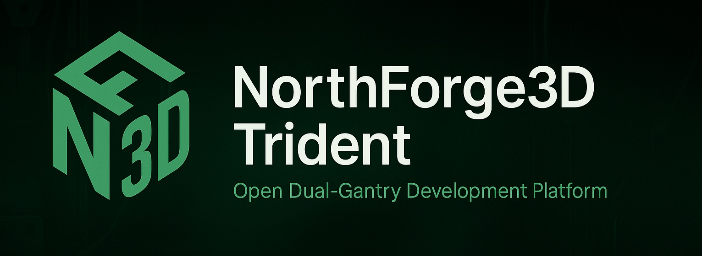

  

# NorthForge3D Trident – Open Development Platform for the Deuce  
### A dual-gantry proof-of-concept for the upcoming **NorthForge3D Deuce** – a next-generation, high-precision IDEX 3D printer.

---

## ⚠️ Experimental Project — Do Not Build Yet

This repository is under **active development** and contains **early, unstable, and rapidly changing work**.

The NorthForge3D Trident is our **motion lab**: a Trident-footprint, dual-gantry platform we’re using to prove out the mechanics, motion control, and behavior that will define the Deuce.

It is **not**:

- A finished printer  
- A drop-in Voron derivative  
- A recommended build at this stage  

- It will be a modded Voron Trident, with dual gantry printing.
- A really cool build if you want to watch and build one yourself
  
If you’d like to follow the progress—and get updates as this build and eventually our printer the Deuce evolve—you can start here:

👉 **Follow the Trident Build and the Deuce as They Evolve**  
https://northforge3d.com/forge-with-us/

👉 **Main Site**  
https://northforge3d.com

A full video series will be published once the Modded Trident design stabilizes.

---

## 🔥 What This Project Is

This repository documents the **engineering, testing, and evolution** of the NorthForge3D **Trident-based dual-gantry test platform**.

Think of it as our:

- Dual-gantry motion testbed  
- Toolhead choreography sandbox  
- Collision-avoidance and synchronization playground  
- Early electronics and layout experiment  
- Mechanical R&D platform for the Deuce

Everything here is **iterating frequently**. Expect redesigns, experiments, and the occasional controlled chaos.

---

## 🎯 Goals of the Proof-of-Concept Printer

### 1. Validate Dual-Gantry Motion

We need a reliable platform to test:

- Independent toolheads  
- Parallel / mirror / duplication print modes  
- Coordinated multi-tool workflows  
- High-speed motion with tight synchronization  
- Collision detection / avoidance strategies  

### 2. Redesign Major Subsystems

While this machine starts from a Trident footprint, it will diverge significantly:

- Fully redesigned **bottom section**  
  - No Voron skirt  
  - **Inverted electronics** visible inside the chamber  
  - Clean, service-friendly layout
- Raspberry Pi on a custom plate with **side-facing ports**  
- Redesigned **dual (eventual quad) gantry**  
- Lightweight toolheads  
- Filament cutter v2  
- New cable routing approaches  
- Modified or fully custom gantry components  
- Custom motors, pulley arrangements, and belt routing as needed  

### 3. Prototype a Production-Forward Layout

This proof-of-concept exists to test:

- Thermal behavior inside the frame  
- Cable access and serviceability  
- Component placement and reach  
- Mechanical accessibility and maintenance paths  
- The aesthetic and functional “feel” of a future NorthForge3D printer  

All of that informs the production-grade **Deuce**.

---

## 🧱 Hardware Decisions (So Far)

Current planned / in-use hardware includes:

- **0.9° NEMA 17 motors** – ~0.54 Nm, 42×48 mm  
- **0.9° pancake steppers** for toolheads  
- **T8×2 (single-start) lead screws** for ultra-fine Z resolution  
- **Klipper-based electronics**  
- Raspberry Pi with external-facing I/O  
- Additional hardware will be added as testing continues

Hardware choices may change as we prove things out.

---

## 📌 Status: Early Development

This repository is currently being **cleaned**, **reorganized**, and aligned to the new design direction.

In the near term:

- Remaining Voron-specific content will be removed  
- Bottom section redesign will be introduced  
- Early dual-gantry motion tests will be shared  
- CAD development will continue in Fusion 360  
- Development logs will grow as milestones are reached  

Expect the design and structure here to change often as the Trident comes together.

---

## 📅 Development Logs

We’re documenting progress in plain language as the project evolves. Logs will capture:

- CAD progress  
- Mechanical R&D  
- Firmware experiments  
- Toolhead ideas and tests  
- Renders / photos as the machine takes shape  
- Iterative design changes  
- Lessons learned and upcoming plans  

Long term, these logs will pair with a video series and deeper written documentation.

---

## 🧪 This Is Not the Deuce

The final **NorthForge3D Deuce** will be:

- Larger and fully enclosed  
- Built on a custom extrusion frame  
- Outfitted with production-grade electronics  
- Running refined dual-gantry mechanisms  
- Built with collision-resistant logic and robust safety considerations  
- Equipped with custom motors, pulleys, and motion components  
- Designed with full internal lighting and service access paths  

The Trident exists to **perfect the motion, firmware, and mechanical fundamentals** before we commit them to the Deuce.

---

## 🔗 Follow the Project

👉 **Website**  
https://northforge3d.com

👉 **Subscribe for Development Updates**  
https://northforge3d.com/forge-with-us/

👉 **Deuce Engineering Blog**  
https://northforge3d.com/forge-updates/deuce-updates/

👉 **Facebook** (short updates & announcements)  
https://www.facebook.com/NorthForge3D/

👉 **YouTube** (full build series coming)  
https://www.youtube.com/@northforge3d

👉 **Instagram** (visual progress, behind the scenes)  
https://www.instagram.com/northforge3d/

---

## 📜 License

This project is currently released under the **GNU GPLv3** license.

As the proof-of-concept solidifies, we will clearly identify:

- Which components originate from Voron Trident  
- Which components are original NorthForge3D designs  

The license will remain **GPLv3**.

---

## 🤝 Contributions

This is an active engineering development project.  
Contributions and discussion are welcome — just be aware that:

- The design moves quickly  
- Files may be reorganized  
- Some ideas will be replaced as better solutions emerge  

If you’d like to collaborate, please open an **issue** or a **pull request**.

---

### 📘 Additional Project Files

👉 **[CHANGELOG.md](./CHANGELOG.md)** — Full development history  
👉 **[TODO.md](./TODO.md)** — Active engineering & documentation tasks

